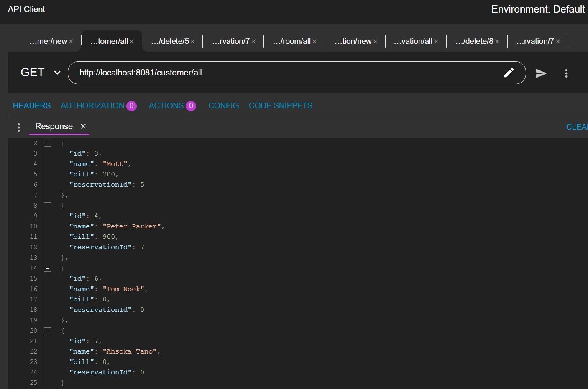
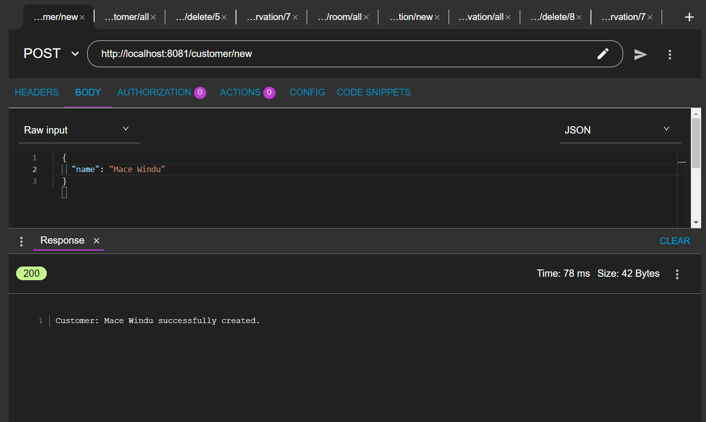
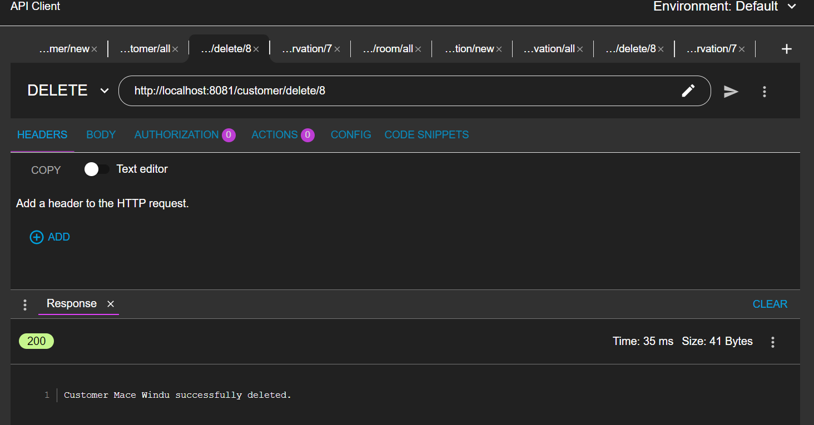
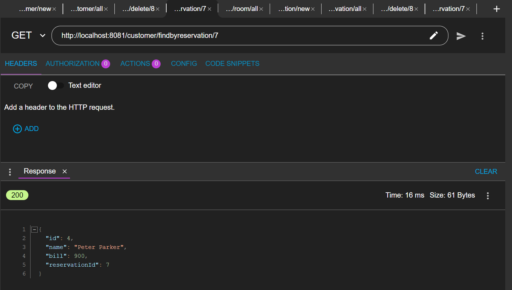
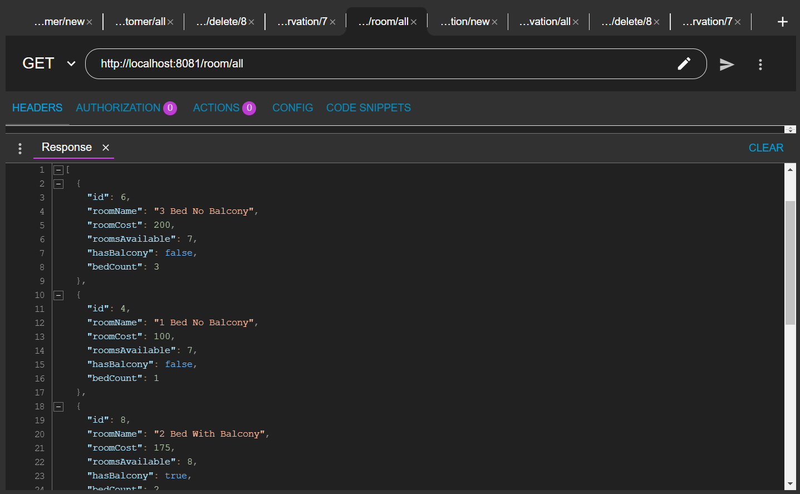
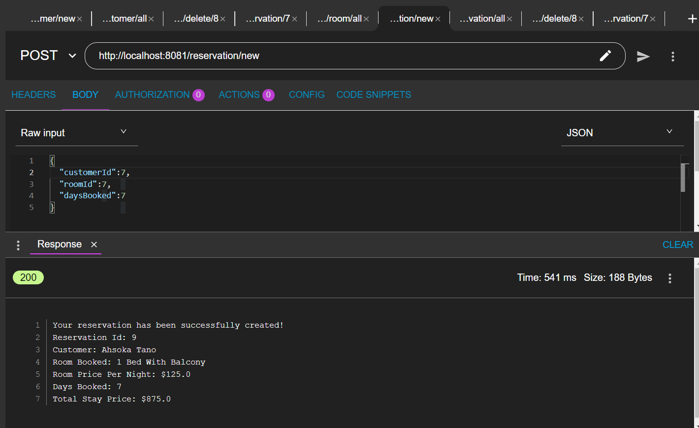
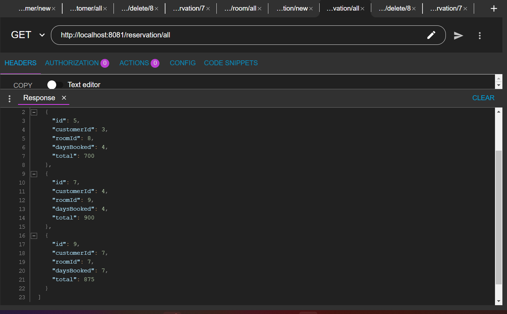
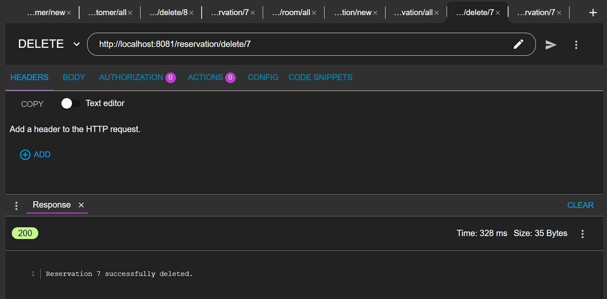
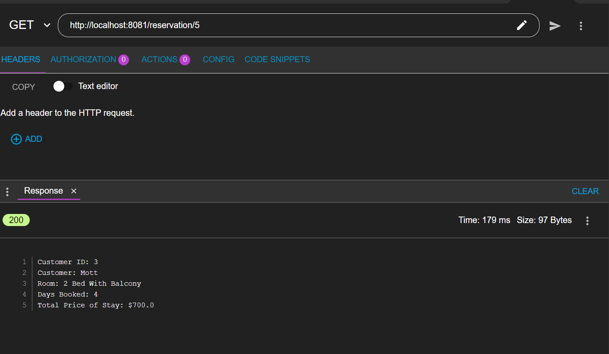

# Customer Reservation Service

## Project Description

A Simple REST Reservation Service for customers to create accounts, browse hotel rooms, create reservations and manage the created reservations. Connects to a secondary REST service and a SOAP service.

## Technologies Used

* Java - 8u311
* Spring - version 5.3.18
* SOAP - version 1.2
* REST - v2

## Features

List of features ready and TODOs for future development
* Create Customer Accounts
* Search, View, and Delete customers by Name, Id, and ReservationID
* Search Rooms available for booking reservations
* Book reservations from available rooms.
* Search, View, and Delete reservations by Reservation IDs 

To-do list:
* Improve documentation
* Implement more hotel options
## Getting Started
   
git clone https://github.com/4-4-2022/Brandon_Learned_p1.git
Installations Required: JDK8, Maven, Spring Tool Suite 4

## Usage
View the images below for proper HTTP Request formats:

<figcaption>View All Created Customers</figcaption>

Create a New Customer

Delete a Customer

Find Customers by their ReservationIDs

View Rooms that can be booked

Create new reservations

View all Reservations

Delete a reservations by ID

View a reservation by ID

